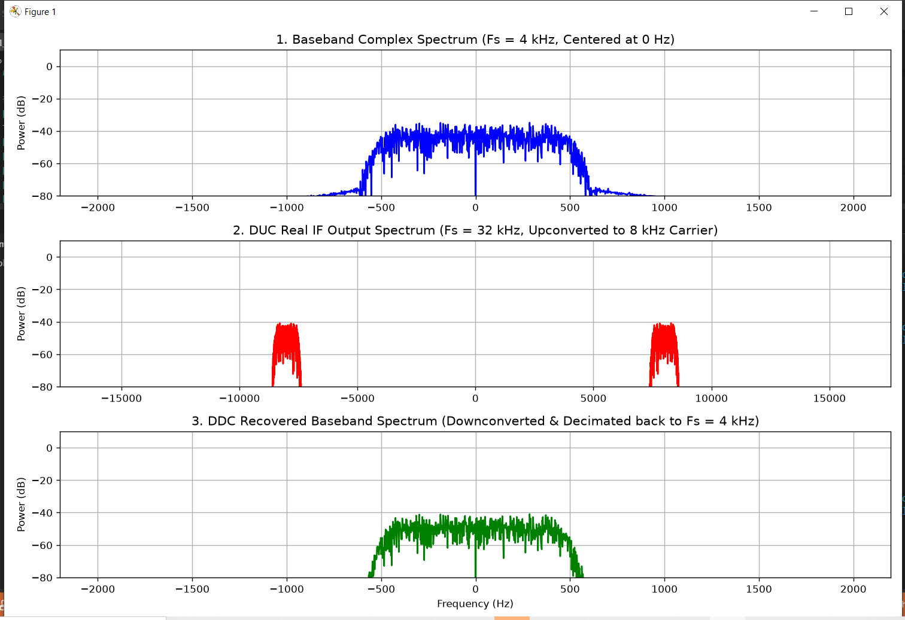
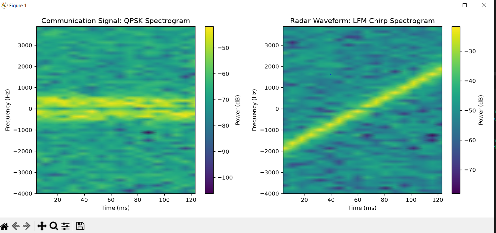

# End-to-End Multirate SDR Transceiver Chain & Automatic Signal Classifier

An end-to-end Software Defined Radio (SDR) transceiver pipeline and signal classification engine built in Python (`NumPy`/`SciPy`). The project demonstrates multirate digital down/up-conversion (DDC/DUC), pulse-shaping FIR filtering, AWGN channel simulation, and feature extraction for automatic modulation and waveform classification (QPSK vs. LFM Radar Chirp).

---

## Key Features

* **Digital Up-Converter (DUC):** Interpolates baseband complex symbols by $8\times$, applies Root-Raised Cosine (RRC) pulse shaping, and upconverts baseband to an $8\text{ kHz}$ Intermediate Frequency (IF).
* **AWGN Channel Modeling:** Simulates realistic wireless channel degradation with controllable SNR ($0\text{ to }20\text{ dB}$).
* **Digital Down-Converter (DDC):** Quadrature down-conversion with NCO mixing, anti-aliasing FIR filtering, and $8\times$ decimation back to baseband.
* **Feature Extraction Engine:** Computes envelope variance, Higher-Order Cumulants ($C_{40}$), and instantaneous frequency deviation.
* **Time-Frequency Analysis:** STFT spectrogram generation to distinguish communications signals (QPSK) from radar signatures (LFM Chirp).

---

## Visual Verification & Results

### 1. Multirate DUC/DDC Spectrum Verification
The baseband signal ($f_s = 4\text{ kHz}$) is upconverted to an IF carrier at $8\text{ kHz}$ ($f_s = 32\text{ kHz}$) and successfully downconverted/decimated back to baseband without aliasing or spectral distortion.



### 2. Time-Frequency Waveform Classification
STFT analysis visually separates stationary communications bandwidth (QPSK) from frequency-agile radar waveforms (LFM Chirp).



---

## How to Run

1. Clone the repository:
   ```bash
   git clone [https://github.com/YOUR_USERNAME/sdr-multirate-transceiver-classifier.git](https://github.com/YOUR_USERNAME/sdr-multirate-transceiver-classifier.git)
   cd sdr-multirate-transceiver-classifier